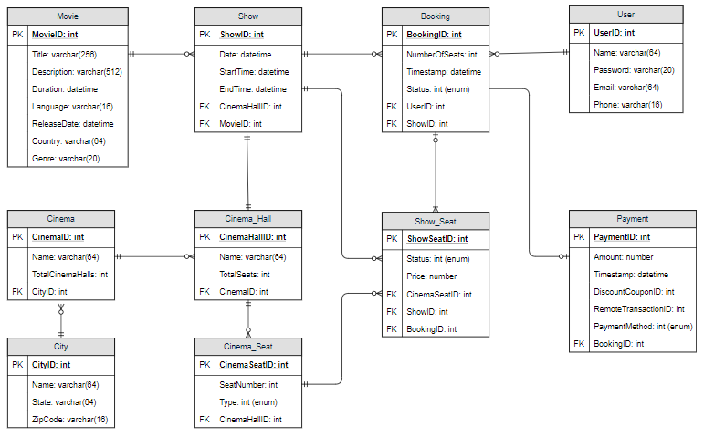
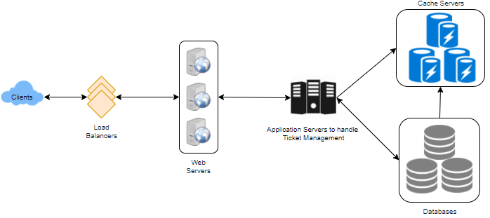
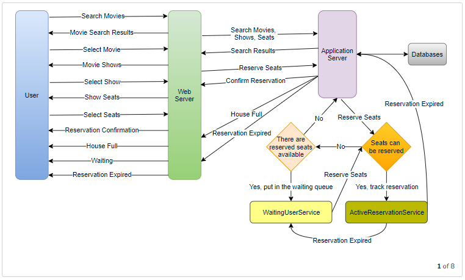
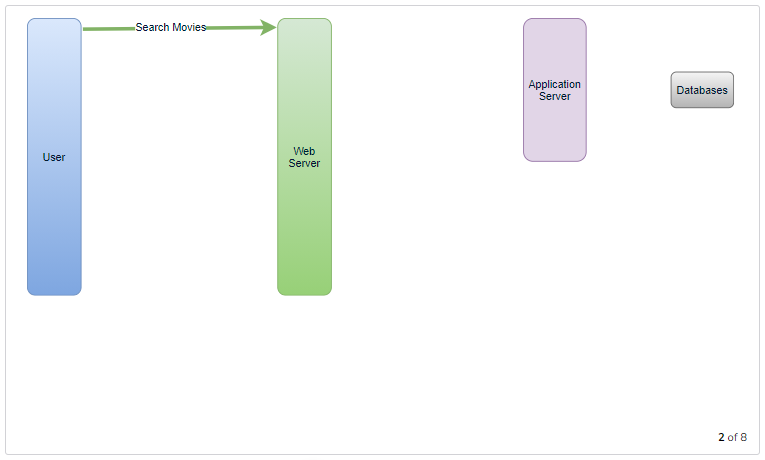
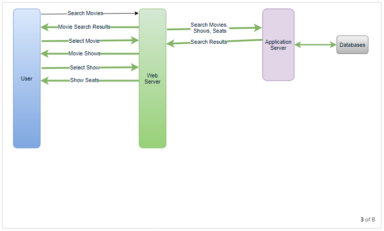
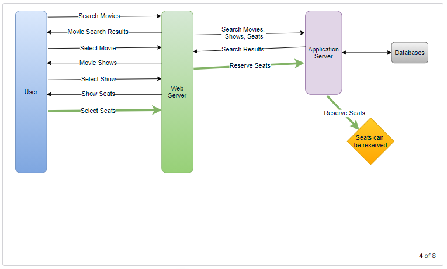
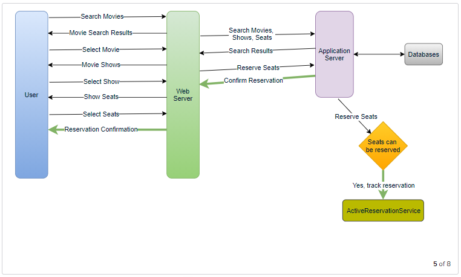
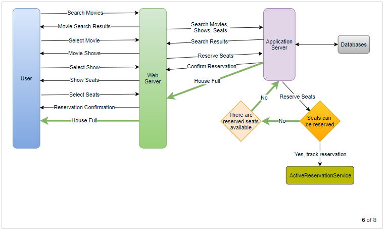
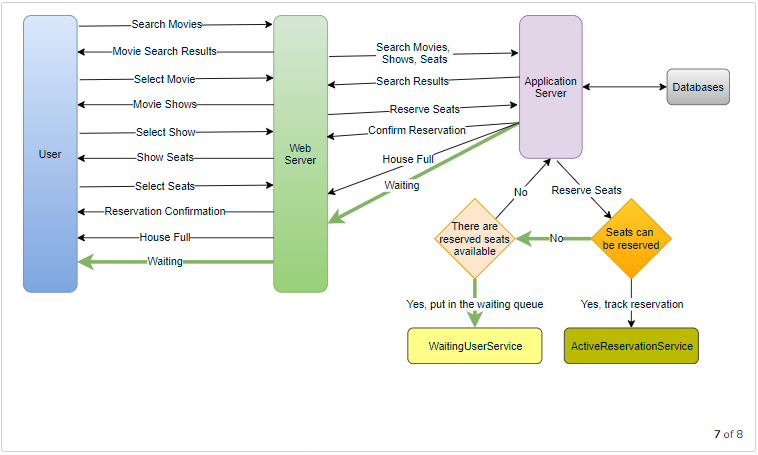
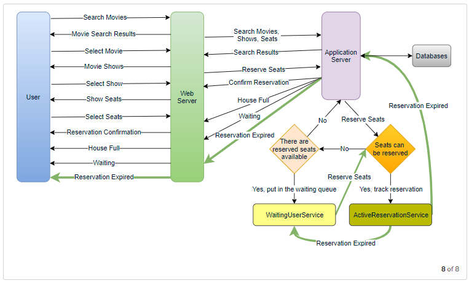

# Design Ticketmaster
-------------------------------------------------

Let's design an online ticketing system that sells movie tickets like Ticketmaster or BookMyShow.

Similar Services: bookmyshow.com, ticketmaster.com
Difficulty Level: Hard

We'll cover the following:
* [1. What is an online movie ticket booking system?](#1-what-is-an-online-movie-ticket-booking-system)
* [2. Requirements and Goals of the System](#2-requirements-and-goals-of-the-system)
* [3. Some Design Considerations](#3-some-design-considerations)
* [4. Capacity Estimation](#4-capacity-estimation)
* [5. System APIs](#5-system-apis)
* [6. Database Design](#6-database-design)
* [7. High Level Design](#7-high-level-design)
* [8. Detailed Component Design](#8-detailed-component-design)
* [9. Concurrency](#9-concurrency)
* [10. Fault Tolerance](#10-fault-tolerance)
* [11. Data Partitioning](#11-data-partitioning)

## 1. What is an online movie ticket booking system?  

A movie ticket booking system provides its customers the ability to purchase theatre seats online. E-ticketing 
systems allow the customers to browse through movies currently being played and to book seats, anywhere 
anytime.

## 2. Requirements and Goals of the System

Our ticket booking service should meet the following requirements:

**Functional Requirements:**

1.  Our ticket booking service should be able to list different cities where its affiliate cinemas are located.
1.  Once the user selects the city, the service should display the movies released in that particular city.
1.  Once the user selects a movie, the service should display the cinemas running that movie and its 
    available showtimes.
1.  The user should be able to choose a show at a particular cinema and book their tickets.
1.  The service should be able to show the user the seating arrangement of the cinema hall. The user should 
    be able to select multiple seats according to their preference.
1.  The user should be able to distinguish available seats from booked ones.
1.  Users should be able to put a hold on the seats for five minutes before they make a payment to finalize 
    the booking.
1.  The user should be able to wait if there is a chance that the seats might become available, e.g., when 
    holds by other users expire.
1.  Waiting customers should be serviced in a fair, first come, first serve manner.

**Non-Functional Requirements:**

1.  The system would need to be highly concurrent. There will be multiple booking requests for the same 
    seat at any particular point in time. The service should handle this gracefully and fairly.
1.  The core thing of the service is ticket booking, which means financial transactions. This means that the 
    system should be secure and the database ACID compliant.

## 3. Some Design Considerations

1.  For simplicity, let’s assume our service does not require any user authentication.
1.  The system will not handle partial ticket orders. Either user gets all the tickets they want or they get 
    nothing.
1.  Fairness is mandatory for the system.
1.  To stop system abuse, we can restrict users from booking more than ten seats at a time.
1.  We can assume that traffic would spike on popular/much-awaited movie releases and the seats would fill 
    up pretty fast. The system should be scalable and highly available to keep up with the surge in traffic.
    
## 4. Capacity Estimation

**Traffic estimates:** Let’s assume that our service has 3 billion page views per month and sells 10 million 
tickets a month.

**Storage estimates:** Let’s assume that we have 500 cities and, on average each city has ten cinemas. If there 
are 2000 seats in each cinema and on average, there are two shows every day.

Let’s assume each seat booking needs 50 bytes (IDs, NumberOfSeats, ShowID, MovieID, SeatNumbers, 
SeatStatus, Timestamp, etc.) to store in the database. We would also need to store information about movies 
and cinemas; let’s assume it’ll take 50 bytes. So, to store all the data about all shows of all cinemas of all cities 
for a day:

>                 **500 cities * 10 cinemas * 2000 seats * 2 shows * (50+50) bytes = 2GB / day**

To store five years of this data, we would need around 3.6TB.

## 5. System APIs

We can have SOAP or REST APIs to expose the functionality of our service. The following could be the 
definition of the APIs to search movie shows and reserve seats.

```
SearchMovies(api_dev_key, keyword, city, lat_long, radius, start_datetime, end_datetime, 
postal_code, includeSpellcheck, results_per_page, sorting_order)
```

**Parameters:**
```
api_dev_key (string)                   : The API developer key of a registered account. This will be used to, among other things, 
                                         throttle users based on their allocated quota.
keyword (string)                       : Keyword to search on.
city (string)                          : City to filter movies by.
lat_long (string)                      : Latitude and longitude to filter by.
radius (number)                        : Radius of the area in which we want to search for events.
start_datetime (string)                : Filter movies with a starting datetime.
end_datetime (string)                  : Filter movies with an ending datetime.
postal_code (string)                   : Filter movies by postal code / zipcode.
includeSpellcheck (Enum: “yes” or “no”): Yes, to include spell check suggestions in the response.
results_per_page (number)              : Number of results to return per page. Maximum is 30.
sorting_order (string)                 : Sorting order of the search result. Some allowable values : ‘name,asc’, ‘name,desc’, 
                                         ‘date,asc’, ‘date,desc’, ‘distance,asc’, ‘name,date,asc’, ‘name,date,desc’, ‘date,name,asc’, ‘date,name,desc’.
```

**Returns: (JSON)**
Here is a sample list of movies and their shows:

```json
[
  {
    "MovieID": 1,
    "ShowID": 1,
    "Title": "Cars 2",
    "Description": "About cars",
    "Duration": 120,
    "Genre": "Animation",
    "Language": "English",
    "ReleaseDate": "8th Oct. 2014",
    "Country": USA,
    "StartTime": "14:00",
    "EndTime": "16:00",
    "Seats": 
    [
      {  
        "Type": "Regular"
        "Price": 14.99
        "Status: "Almost Full"
      },
      {  
        "Type": "Premium"
        "Price": 24.99
        "Status: "Available"
      }
    ]
  },
  {
    "MovieID": 1,
    "ShowID": 2,
    "Title": "Cars 2",
    "Description": "About cars",
    "Duration": 120,
    "Genre": "Animation",
    "Language": "English",
    "ReleaseDate": "8th Oct. 2014",
    "Country": USA,
    "StartTime": "16:30",
    "EndTime": "18:30",
    "Seats": 
    [
        {  
          "Type": "Regular"
          "Price": 14.99
          "Status: "Full"
      },
        {  
          "Type": "Premium"
        "Price": 24.99
        "Status: "Almost Full"
      }
    ]
  },
]
```

```
ReserveSeats(api_dev_key, session_id, movie_id, show_id, seats_to_reserve[])
```

**Parameters:**

```
api_dev_key (string)        : same as above
session_id (string)         : User’s session ID to track this reservation. Once the reservation time expires, user’s 
                              reservation on the server will be removed using this ID.
movie_id (string)           : Movie to reserve.
show_id (string)            : Show to reserve.
seats_to_reserve (number)   : An array containing seat IDs to reserve.
```

**Returns: (JSON)**

Returns the status of the reservation, which would be one of the following: 1) “Reservation Successful” 2) 
“Reservation Failed - Show Full,” 3) “Reservation Failed - Retry, as other users are holding reserved seats”.

## 6. Database Design

Here are a few observations about the data we are going to store:

1.  Each City can have multiple Cinemas.
1.  Each Cinema will have multiple halls.
1.  Each Movie will have many Shows and each Show will have multiple Bookings.
1.  A user can have multiple bookings.



## 7. High Level Design

At a high-level, our web servers will manage users’ sessions and application servers will handle all the ticket 
management, storing data in the databases as well as working with the cache servers to process reservations.



## 8. Detailed Component Design  

First, let’s try to build our service assuming it is being served from a single server.

**Ticket Booking Workflow:** The following would be a typical ticket booking workflow:

1.  The user searches for a movie.
1.  The user selects a movie.
1.  The user is shown the available shows of the movie.
1.  The user selects a show.
1.  The user selects the number of seats to be reserved.
1.  If the required number of seats are available, the user is shown a map of the theater to select seats. If not, 
    the user is taken to ‘step 8’ below.
1.  Once the user selects the seat, the system will try to reserve those selected seats.
1.  If seats can’t be reserved, we have the following options:
    * Show is full; the user is shown the error message.
    * The seats the user wants to reserve are no longer available, but there are other seats available, so the 
      user is taken back to the theater map to choose different seats.
    * There are no seats available to reserve, but all the seats are not booked yet, as there are some seats that 
      other users are holding in the reservation pool and have not booked yet. The user will be taken to a 
      waiting page where they can wait until the required seats get freed from the reservation pool. This 
      waiting could result in the following options:
        - If the required number of seats become available, the user is taken to the theater map page where 
          they can choose seats.
        - While waiting, if all seats get booked or there are fewer seats in the reservation pool than the user 
          intends to book, the user is shown the error message.
        - User cancels the waiting and is taken back to the movie search page.
        - At maximum, a user can wait one hour, after that user’s session gets expired and the user is taken 
          back to the movie search page.
1.  If seats are reserved successfully, the user has five minutes to pay for the reservation. After payment, the 
    booking is marked complete. If the user is not able to pay within five minutes, all their reserved seats are 
    freed to become available to other users.










**How would the server keep track of all the active reservations that haven’t been booked yet? And how 
would the server keep track of all the waiting customers?** 
We need two daemon services, one to keep track of all active reservations and remove any expired 
reservation from the system; let’s call it **ActiveReservationService**. The other service would be keeping track 
of all the waiting user requests and, as soon as the required number of seats become available, it will notify 
the (the longest waiting) user to choose the seats; let’s call it **WaitingUserService**.

**a. ActiveReservationsService**

We can keep all the reservations of a ‘show’ in memory in a data structure similar to [Linked HashMap](https://docs.oracle.com/javase/7/docs/api/java/util/LinkedHashMap.html) or a 
[TreeMap](https://docs.oracle.com/javase/6/docs/api/java/util/TreeMap.html) in addition to keeping all the data in the database. We will need a linked HashMap kind of data 
structure that allows us to jump to any reservation to remove it when the booking is complete. Also, since we 
will have expiry time associated with each reservation, the head of the HashMap will always point to the 
oldest reservation record so that the reservation can be expired when the timeout is reached.

To store every reservation for every show, we can have a HashTable where the ‘key’ would be ‘ShowID’, and 
the ‘value’ would be the Linked HashMap containing ‘BookingID’ and creation ‘Timestamp’.

In the database, we will store the reservation in the ‘Booking’ table and the expiry time will be in the 
Timestamp column. The ‘Status’ field will have a value of ‘Reserved (1)’ and, as soon as a booking is complete, 
the system will update the ‘Status’ to ‘Booked (2)’ and remove the reservation record from the Linked 
HashMap of the relevant show. When the reservation is expired, we can either remove it from the Booking 
table or mark it ‘Expired (3)’ in addition to removing it from memory.

ActiveReservationsService will also work with the external financial service to process user payments. 
Whenever a booking is completed, or a reservation gets expired, WaitingUsersService will get a signal so that 
any waiting customer can be served.


**b. WaitingUsersService**

Just like ActiveReservationsService, we can keep all the waiting users of a show in memory in a Linked 
HashMap or a TreeMap. We need a data structure similar to Linked HashMap so that we can jump to any user 
to remove them from the HashMap when the user cancels their request. Also, since we are serving in a first-
come-first-serve manner, the head of the Linked HashMap would always be pointing to the longest waiting 
user, so that whenever seats become available, we can serve users in a fair manner.

We will have a HashTable to store all the waiting users for every Show. The ‘key’ would be 'ShowID, and the 
‘value’ would be a Linked HashMap containing ‘UserIDs’ and their wait-start-time.

Clients can use [Long Polling](https://en.wikipedia.org/wiki/Push_technology#Long_polling) for keeping themselves updated for their reservation status. Whenever seats 
become available, the server can use this request to notify the user.

**Reservation Expiration**

On the server, ActiveReservationsService keeps track of expiry (based on reservation time) of active 
reservations. As the client will be shown a timer (for the expiration time), which could be a little out of sync 
with the server, we can add a buffer of five seconds on the server to safeguard from a broken experience, 
such that the client never times out after the server, preventing a successful purchase.

## 9. Concurrency

**How to handle concurrency, such that no two users are able to book the same seat.** We can use 
transactions in SQL databases to avoid any clashes. For example, if we are using an SQL server we can 
utilize [Transaction Isolation Levels](https://docs.microsoft.com/en-us/sql/odbc/reference/develop-app/transaction-isolation-levels) to lock the rows before we can update them. Here is the sample code:

```jql
SET TRANSACTION ISOLATION LEVEL SERIALIZABLE;

BEGIN TRANSACTION;

    -- Suppose we intend to reserve three seats (IDs: 54, 55, 56) for ShowID=99 
    Select * From Show_Seat where ShowID=99 && ShowSeatID in (54, 55, 56) && Status=0 -- free 

    -- if the number of rows returned by the above statement is three, we can update to 
    -- return success otherwise return failure to the user.
    update Show_Seat ...
    update Booking ...

COMMIT TRANSACTION;
```

‘Serializable’ is the highest isolation level and guarantees safety from [Dirty](https://en.wikipedia.org/wiki/Isolation_(database_systems)#Dirty_reads), [Nonrepeatable](https://en.wikipedia.org/wiki/Isolation_(database_systems)#Non-repeatable_reads), and [Phantoms](https://en.wikipedia.org/wiki/Isolation_(database_systems)#Phantom_reads) 
reads. One thing to note here; within a transaction, if we read rows, we get a write lock on them so that they 
can’t be updated by anyone else.

Once the above database transaction is successful, we can start tracking the reservation in 
ActiveReservationService.

## 10. Fault Tolerance

**What happens when ActiveReservationsService or WaitingUsersService crashes?**

Whenever ActiveReservationsService crashes, we can read all the active reservations from the ‘Booking’ 
table. Remember that we keep the ‘Status’ column as ‘Reserved (1)’ until a reservation gets booked. Another 
option is to have a primary-secondary configuration so that, when the primary crashes, the secondary can 
take over. We are not storing the waiting users in the database, so, when WaitingUsersService crashes, we 
don’t have any means to recover that data unless we have a primary-secondary setup.

Similarly, we’ll have a primary-secondary setup for databases to make them fault-tolerant.

# 11. Data Partitioning

**Database partitioning:** If we partition by ‘MovieID’, then all the Shows of a movie will be on a single server. 
For a very hot movie, this could cause a lot of load on that server. A better approach would be to partition 
based on ShowID; this way, the load gets distributed among different servers.

**ActiveReservationService and WaitingUserService partitioning:** Our web servers will manage all the 
active users’ sessions and handle all the communication with the users. We can use the [Consistent Hashing](../017_Glossary_Of_System_Design_Basics/010_Consistent_Hashing/README.md) to 
allocate application servers for both ActiveReservationService and WaitingUserService based upon the 
‘ShowID’. This way, all reservations and waiting users of a particular show will be handled by a certain set of 
servers. Let’s assume for load balancing our [Consistent Hashing](../017_Glossary_Of_System_Design_Basics/010_Consistent_Hashing/README.md) allocates three servers for any Show, so 
whenever a reservation is expired, the server holding that reservation will do the following things:

1.  Update the database to remove the Booking (or mark it expired) and update the seats’ Status in 
    ‘Show_Seats’ table.
1.  Remove the reservation from the Linked HashMap.
1.  Notify the user that their reservation has expired.
1.  Broadcast a message to all WaitingUserService servers that are holding waiting users of that Show to 
    figure out the longest waiting user. Consistent Hashing scheme will tell what servers are holding these 
    users.
1.  Send a message to the WaitingUserService server holding the longest waiting user to process their 
    request if required seats have become available.

Whenever a reservation is successful, following things will happen:

1.  The server holding that reservation sends a message to all servers holding the waiting users of that Show, 
    so that those servers can expire all the waiting users that need more seats than the available seats.
1.  Upon receiving the above message, all servers holding the waiting users will query the database to find 
    how many free seats are available now. A database cache would greatly help here to run this query only 
    once.
1.  Expire all waiting users who want to reserve more seats than the available seats. For this, 
    WaitingUserService has to iterate through the Linked HashMap of all the waiting users.

:back:[**Back - Designing Uber backend**](../014_Designing_Uber_backend/README.md)
:arrow_right:[**Next - Additional Resources**](../016_Additional_Resources/README.md)

- [ x ] Mark as Completed